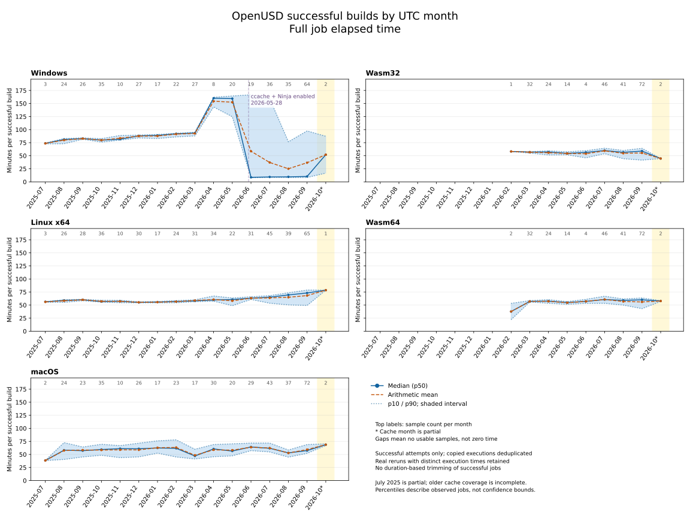

# OpenUSD successful build durations

Actions cache collected: 2026-10-01 17:58:13.104208 UTC.

Platforms: Linux x64, Windows, macOS, Wasm32, Wasm64. Wasm runs on Linux,
but is kept separate here as a target platform. GPU-only tests and validation
jobs are excluded. Native coverage begins July 31, 2025; wasm begins February
2026. October 2026 is partial. This is retained cache coverage, not proof that
earlier builds did not run. No new GitHub collection was performed.

## Successful full-job duration, minutes

| Platform | Samples | p10 | Median | p90 | Mean |
|---|---:|---:|---:|---:|---:|
| Linux x64 | 442 | 54.65 | 59.43 | 73.00 | 61.07 |
| Windows | 375 | 8.79 | 81.82 | 123.56 | 70.28 |
| macOS | 410 | 45.70 | 58.92 | 70.68 | 58.83 |
| Wasm32 | 236 | 44.90 | 57.35 | 62.12 | 56.06 |
| Wasm64 | 237 | 46.89 | 58.30 | 62.35 | 57.15 |



Windows' vertical marker is 2026-05-28, the UTC commit date
that introduced persistent ccache and switched to Ninja:
[workflow change](https://github.com/PixarAnimationStudios/OpenUSD/commit/528289b55f035f660f852c69fe930ebe50dac6fc).
Monthly points mix jobs before and after a change; this date is not a claim
that every branch or in-flight workflow adopted it immediately.

[Build-step-only graph](openusd_build_timings_build_step_monthly.svg)

## Filtering and interpretation

- Require completed job status and success conclusion, with positive elapsed time.
- If steps are present, require a successful Build USD step and no failed,
  cancelled, or timed-out steps. A skipped cache-save step is permitted.
- When steps are absent, retain successful job-level records; step-only stats
  omit these jobs rather than treating missing steps as zero minutes.
  Step-only and full-job statistics therefore use different sample sets.
- Deduplicate records with the same run ID, job name, start, and end timestamps.
  Real reruns with different execution times remain separate observations.
- Do not trim fast or slow successful jobs just because of their duration.
  Successful short Windows jobs have successful build/test steps; cache effects
  and changing workflow behavior may produce real timing variation.
- Full-job elapsed time includes setup, build, test, and artifact handling,
  but excludes queue time. It is not a compilation-only measurement.
- Percentiles use inclusive linear interpolation at rank (n - 1) * p.
  Means and pooled percentiles weight individual executions, not months equally.
- Monthly bins use job start time in UTC. A low sample count makes quantiles
  unstable; n=1 has identical p10, median, p90, and mean.

| Filter outcome | Jobs |
|---|---:|
| duplicate_execution | 67 |
| included | 1700 |
| not_successful | 385 |

Included jobs lacking step detail: 724.

## Cost-model use

The monthly Windows median changes sharply around June 2026, with both short
and long successful executions afterward. A pooled historical average is not
necessarily representative of the current workflow. Linux durations also trend
upward. Inspect monthly data before selecting a forward-looking duration.

Wasm32 and Wasm64 must be budgeted as separate Linux-hosted build targets.
Use the arithmetic mean for expected successful-build compute; p10/median/p90
describe duration variability, not the low/mid/high trigger-growth scenarios.
These hosted-runner measurements are not benchmarks of the proposed g6/Mac
hardware. Failed attempts still consume compute even though this analysis
excludes them. Trigger forecasts include reruns, but successful-only durations
do not by themselves estimate failure overhead or selective-rerun fan-out.
Wasm configuration counts and activation date within Year 1 must be specified
before replacing the existing native-only budget. Wasm artifact sizes also
need separate measurement. The 16-configuration allocation is provisional.

## Data and reproduction

- [Monthly statistics CSV](openusd_build_timings_monthly.csv)
- [Pooled statistics CSV](openusd_build_timings_summary.csv)
- [Job-level timing and filter audit CSV](openusd_build_timings_jobs.csv)
- Source: local Dolt workflow_jobs/workflow_runs, cached directly from the
  [GitHub Actions jobs API](https://docs.github.com/en/rest/actions/workflow-jobs).
  GH Archive does not supply these timing records.

```sh
uv run python analyze_build_timings.py
```
